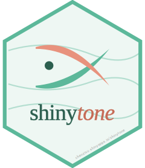

# shinytone 

> A Citation Tone Research Hub: an interactive Shiny app and R package
> for citation-tone research workflows across tone languages.

Developed by [Chenzi Xu](https://chenzixu.rbind.io/). Co-authored with
[Cong Zhang](https://congzhang-linguist.github.io).

<!-- badges: start -->
[](https://opensource.org/licenses/MIT)
[](https://github.com/chenchenzi/citationtone_hub/actions/workflows/pkgdown.yaml)
[](https://chenzixu.shinyapps.io/shinytone/)
<!-- badges: end -->

## Contents

- [Overview](#overview)
- [Features](#features)
- [Two ways to use it](#two-ways-to-use-it)
- [Installation](#installation)
- [Quick start](#quick-start)
- [When the online app is enough](#when-the-online-app-is-enough)
- [Documentation](#documentation)
- [Citation](#citation)
- [License](#license)
- [Authors](#authors)

## Overview

**shinytone** integrates the full citation-tone analysis workflow into a
single place: pitch extraction, by-speaker f0 normalisation,
growth-curve and generalised additive mixed-effects models, outlier and
artefact inspection, and Chao tone numeral summarisation. It is
designed for phoneticians, typologists, fieldworkers, and students
working on lexical tone production.

## Features

- 🎙️ **F0 processing**: extract f0 from `.wav` files with `wrassp` or
  Praat, including a downloadable Praat script tailored to your settings.
- 🔍 **Inspect**: token-level outlier flags (by-speaker z-score) and
  sample-level artefact detection (octave jumps, rate-of-change
  violations, carryover frames; Steffman & Cole 2022).
- 📏 **Normalise**: by-speaker semitone or z-score normalisation, with
  simple or weighted speaker means.
- 📈 **Visualise**: f0 contours coloured by tone, with optional
  faceting by speaker.
- 📊 **Model**: per-token Legendre polynomials, growth-curve analysis
  (GCA) on orthogonal polynomials, and generalised additive mixed
  models (GAMM) with optional AR1 correction.
- 🧮 **Summarise**: convert contours into Chao tone numerals using
  three FOR methods (reference-line, interval, robust).

## Two ways to use it

### 1. Online app (zero install)

The hosted version runs at
<https://chenzixu.shinyapps.io/shinytone/>. Best for classroom demos,
trying out the workflow without setup, and any analysis where
per-upload batches stay under ~100 MB.

### 2. Local R package (full control)

```r
# install.packages("remotes")
remotes::install_github("chenchenzi/citationtone_hub")
```

Then either launch the same Shiny UI offline:

```r
shinytone::run_app()
```

…or call the analytical functions directly from a script or
RMarkdown document:

```r
library(shinytone)
data(sample_f0)

# Normalise to semitones, by speaker
normed <- normalise_f0(sample_f0,
                       f0      = "f0_Hz",
                       speaker = "speaker",
                       tone    = "tone",
                       method  = "semitone")

# Convert mean contours to Chao tone numerals
mc   <- compute_mean_contour(sample_f0,
                             token = "token", f0 = "f0_Hz",
                             time  = "time",  tone = "tone")
chao <- contour_to_chao(mc,
                        raw_data  = sample_f0,
                        raw_token = "token",
                        raw_f0    = "f0_Hz",
                        raw_tone  = "tone")
chao[, c("tone", "refline", "interval", "robust", "shape")]
```

## Installation

| Goal | Command |
|---|---|
| Try without installing | Visit <https://chenzixu.shinyapps.io/shinytone/> |
| Latest dev version | `remotes::install_github("chenchenzi/citationtone_hub")` |

Dependencies are listed in `DESCRIPTION`. The most demanding ones
(`mgcv`, `lme4`, `tuneR`, `rPraat`, `praatpicture`) are installed
automatically.

## Quick start

A complete walkthrough using the bundled `sample_f0` dataset lives in
the [Get started](https://chenchenzi.github.io/citationtone_hub/articles/shinytone.html)
vignette. Highlights:

```r
library(shinytone)
data(sample_f0)        # bundled corpus, 38,808 rows, 13 speakers

# Inspect for outliers and pitch-tracking artefacts
result <- inspect_f0(sample_f0, f0 = "f0_Hz", token = "token",
                     time = "time", speaker = "speaker", tone = "tone")

# Fit a polynomial model per token
poly_coefs <- fit_polynomial(sample_f0, f0 = "f0_Hz", degree = 2)
```

## When the online app is enough

| Use case | Online app | Local package |
|---|:---:|:---:|
| Trying it out / teaching | ✅ | ✅ |
| Typical research datasets (hundreds to a few thousand tokens) | ✅ | ✅ |
| Per-upload batch over 100 MB | ❌ | ✅ |
| Ethics-restricted recordings (children, clinical, etc.) | ❌ | ✅ |
| Scripted / batch / RMarkdown analysis | ❌ | ✅ |
| Three+ simultaneous collaborators | limited | ✅ |

## Documentation

- 📘 [Get started vignette](https://chenchenzi.github.io/citationtone_hub/articles/shinytone.html)
- 📚 [Function reference](https://chenchenzi.github.io/citationtone_hub/reference/)
- 📝 [Changelog](https://chenchenzi.github.io/citationtone_hub/news/)

## Citation

If you use Shinytone in published work, please cite both the package
and the methodology paper:

```r
citation("shinytone")
```

> Xu, C., & Zhang, C. (2024). A cross-linguistic review of citation
> tone production studies: Methodology and recommendations. *The
> Journal of the Acoustical Society of America*, 156(4), 2538–2565.
> <https://doi.org/10.1121/10.0032356>

The bundled sample dataset is a subset of:

> Xu, C. (2025). Plastic Mandarin tones: regional identity in prosody.
> *Phonetica*, 82(5), 331–362.
> <https://doi.org/10.1515/phon-2025-0001>

## License

MIT for code. See [LICENSE.md](LICENSE.md) for details. Long-form
tutorials and vignettes are CC BY-NC 4.0; see individual files for
notes.

## Authors

- [Chenzi Xu](https://chenzixu.rbind.io/), developer and maintainer
- [Cong Zhang](https://congzhang-linguist.github.io), co-author of the
  shinytone project
