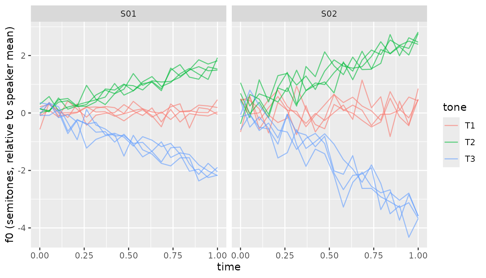

# Getting started with shinytone

## What is shinytone?

**shinytone** is a research hub for *citation tone analysis* in tone
languages. It bundles:

- An interactive Shiny app that walks you through the full workflow —
  pitch extraction, by-speaker f0 normalisation, outlier detection,
  growth-curve and generalised additive mixed models, and Chao tone
  numeral summarisation.
- A small set of pure R functions that implement the analytical core, so
  you can run the same analyses scripted from RMarkdown or another
  package.

This vignette walks through the scripted side using the package’s
bundled sample dataset. If you prefer a graphical workflow, run
[`shinytone::run_app()`](https://chenchenzi.github.io/citationtone_hub/reference/run_app.md)
after installing, or visit the hosted app at
<https://chenzixu.shinyapps.io/shinytone/>.

## Setup

The examples below assume these three packages are loaded:

``` r

library(shinytone)
library(dplyr)
library(ggplot2)
```

## The bundled `sample_f0` dataset

shinytone ships with a real citation-tone corpus available immediately
after
[`library(shinytone)`](https://chenchenzi.github.io/citationtone_hub/).
It contains 38,808 f0 samples from 1,848 tokens across 13 speakers.

``` r

data(sample_f0)
glimpse(sample_f0)
#> Rows: 38,808
#> Columns: 12
#> $ token      <chr> "dc102椅1s10.0125", "dc102椅1s10.0125", "dc102椅1s10.0125", "d…
#> $ index      <int> 1, 2, 3, 4, 5, 6, 7, 8, 9, 10, 11, 12, 13, 14, 15, 16, 17, …
#> $ time       <dbl> 0.090, 0.105, 0.120, 0.135, 0.150, 0.165, 0.180, 0.195, 0.2…
#> $ f0_Hz      <dbl> 245.7078, 246.4516, 247.5111, 248.5496, 249.7015, 251.6647,…
#> $ intensity  <dbl> 69.39095, 71.51177, 72.51483, 72.93342, 73.17195, 73.41046,…
#> $ speaker    <chr> "dc102", "dc102", "dc102", "dc102", "dc102", "dc102", "dc10…
#> $ char       <chr> "椅", "椅", "椅", "椅", "椅", "椅", "椅", "椅", "椅", "椅", "椅", "椅",…
#> $ position   <int> 1, 1, 1, 1, 1, 1, 1, 1, 1, 1, 1, 1, 1, 1, 1, 1, 1, 1, 1, 1,…
#> $ start_time <dbl> 10.0125, 10.0125, 10.0125, 10.0125, 10.0125, 10.0125, 10.01…
#> $ tone       <int> 3, 3, 3, 3, 3, 3, 3, 3, 3, 3, 3, 3, 3, 3, 3, 3, 3, 3, 3, 3,…
#> $ ipa        <chr> "i", "i", "i", "i", "i", "i", "i", "i", "i", "i", "i", "i",…
#> $ vowel      <chr> "i", "i", "i", "i", "i", "i", "i", "i", "i", "i", "i", "i",…
```

The columns we’ll use:

- `token` — unique identifier for each recorded syllable (groups rows of
  the same contour together)
- `time` — time in seconds within each token
- `f0_Hz` — fundamental frequency
- `speaker` — speaker ID
- `tone` — Chao tone category (1-5)
- `char` — the Chinese character of the syllable

See
[`?sample_f0`](https://chenchenzi.github.io/citationtone_hub/reference/sample_f0.md)
for the full schema and source citation.

## Normalise f0 by speaker

Raw Hz isn’t comparable across speakers (men and women have very
different baseline f0).
[`normalise_f0()`](https://chenchenzi.github.io/citationtone_hub/reference/normalise_f0.md)
adds a `speaker_mean` column plus either `f0_st` (semitones, default) or
`f0_zscore`, computed per speaker:

``` r

normed <- normalise_f0(sample_f0,
                       f0          = "f0_Hz",
                       speaker     = "speaker",
                       tone        = "tone",
                       method      = "semitone",
                       mean_method = "weighted")
head(normed[, c("speaker", "tone", "f0_Hz", "speaker_mean", "f0_st")])
#>   speaker tone    f0_Hz speaker_mean     f0_st
#> 1   dc102    3 245.7078     237.0675 0.6197450
#> 2   dc102    3 246.4516     237.0675 0.6720735
#> 3   dc102    3 247.5111     237.0675 0.7463436
#> 4   dc102    3 248.5496     237.0675 0.8188289
#> 5   dc102    3 249.7015     237.0675 0.8988754
#> 6   dc102    3 251.6647     237.0675 1.0344568
```

Now `f0_st` puts every speaker on a comparable scale. To plot the mean
contour per tone, use \[compute_mean_contour()\], which normalises time
to `[0, 1]` *within each token* before averaging. The package function
returns its result in the same `time / f0_predicted / tone` schema used
by \[predict_gca()\] and \[predict_gamm()\]:

``` r

mean_contour <- compute_mean_contour(normed,
                                     token = "token", f0 = "f0_st",
                                     time  = "time",  tone = "tone")

ggplot(mean_contour, aes(time, f0_predicted, colour = factor(tone))) +
  geom_line(linewidth = 1) +
  labs(x = "Normalised time", y = "f0 (semitones)", colour = "Tone")
```



## Inspect for outliers and pitch-tracking artefacts

[`inspect_f0()`](https://chenchenzi.github.io/citationtone_hub/reference/inspect_f0.md)
runs three complementary checks: tokens whose per-token maximum sits
more than `z_threshold` SDs above, or whose minimum more than
`z_threshold` SDs below, the speaker’s other tokens (extreme-value),
tokens whose median is unusual for their speaker and tone (token-level),
and individual samples where the rate of f0 change exceeds physiological
plausibility (sample-level; Sundberg 1973, Steffman & Cole 2022).

The token-level check is tone-relative, so it runs only when a `tone`
column is available. If your tone categories are not yet known (for
example before the clustering / tone-discovery step,
[`cluster_f0()`](https://chenchenzi.github.io/citationtone_hub/reference/cluster_f0.md)),
call
[`inspect_f0()`](https://chenchenzi.github.io/citationtone_hub/reference/inspect_f0.md)
with `tone = NULL`: the speaker-level extreme-value and sample-level
jump checks still run, and only the token-level check is skipped, with
the `tone` column omitted from the output.

``` r

inspected <- inspect_f0(sample_f0,
                        f0      = "f0_Hz",
                        token   = "token",
                        time    = "time",
                        speaker = "speaker",
                        tone    = "tone")

# How many tokens were flagged overall?
inspected |>
  distinct(token, .keep_all = TRUE) |>
  count(flagged_token)
#> # A tibble: 2 × 2
#>   flagged_token     n
#>   <lgl>         <int>
#> 1 FALSE          1586
#> 2 TRUE            262
```

The `flag_notes` column gives a human-readable reason for each flagged
sample (e.g., `"max too high; jump (rise)"`). On the live app, the
Inspect tab lets you click through flagged tokens one by one.

## Fit token-level polynomials

[`fit_polynomial()`](https://chenchenzi.github.io/citationtone_hub/reference/fit_polynomial.md)
returns one row per token with Legendre polynomial coefficients (`c0`,
`c1`, `c2`, …). Useful as features for downstream classifiers, or as a
compact summary of contour shape.

``` r

poly_coefs <- fit_polynomial(normed,
                             f0      = "f0_st",
                             token   = "token",
                             time    = "time",
                             speaker = "speaker",
                             tone    = "tone",
                             degree  = 2)
head(poly_coefs)
#> # A tibble: 6 × 6
#>   token            speaker  tone    c0    c1    c2
#>   <chr>            <chr>   <int> <dbl> <dbl> <dbl>
#> 1 dc102一1s22.3525 dc102       6 -1.53  3.86 0.114
#> 2 dc102一2s22.9425 dc102       6 -1.07  2.62 0.282
#> 3 dc102一3s23.5725 dc102       6 -1.37  2.79 0.474
#> 4 dc102一4s24.1425 dc102       6 -1.14  1.76 0.732
#> 5 dc102一5s24.7925 dc102       6 -1.09  1.90 0.296
#> 6 dc102一6s25.3125 dc102       6 -1.87  2.14 1.28
```

Interpretation:

- `c0` ≈ token-level mean f0 (in semitones, relative to speaker mean)
- `c1` ≈ linear slope across the contour (positive = rising)
- `c2` ≈ curvature (positive = U-shaped, negative = inverted-U)

## Fit a Growth Curve Analysis (GCA)

[`fit_gca()`](https://chenchenzi.github.io/citationtone_hub/reference/fit_gca.md)
is a convenience wrapper around
[`lme4::lmer()`](https://rdrr.io/pkg/lme4/man/lmer.html) with sensible
defaults for tone-shape modelling — orthogonal polynomials on per-token
normalised time, plus conventional random effects on speaker and item.
For non-standard model structures, call
[`lme4::lmer()`](https://rdrr.io/pkg/lme4/man/lmer.html) directly.

``` r

# (Skipped on package build for speed; uncomment to run locally.)
gca <- fit_gca(normed,
               f0      = "f0_st",
               time    = "time",
               token   = "token",
               tone    = "tone",
               speaker = "speaker",
               item    = "char",                 # use Chinese char as item
               degree  = 2,
               random_slope_speaker = FALSE,
               random_slope_item    = FALSE)

# Population-level per-tone curves
preds <- predict_gca(gca, n = 100)
ggplot(preds, aes(time, f0_predicted, colour = tone)) +
  geom_line(linewidth = 1)
```

## Fit a GAMM and check its diagnostics

[`fit_gamm()`](https://chenchenzi.github.io/citationtone_hub/reference/fit_gamm.md)
wraps [`mgcv::bam()`](https://rdrr.io/pkg/mgcv/man/bam.html) with the
smooth structure recommended for tone contours (Sóskuthy 2017): a
reference smooth plus per-tone difference smooths, by-speaker random
smooths, and an optional AR1 correction for the strong within-token
autocorrelation of densely-sampled f0 (`use_ar1 = TRUE`; the app’s GAMM
tab enables it by default). The AR1 parameter rho is estimated from the
lag-1 autocorrelation of the residuals *within* tokens, so token
boundaries do not bias it.
[`diagnose_gamm()`](https://chenchenzi.github.io/citationtone_hub/reference/diagnose_gamm.md)
then answers the model-checking questions in one call: is the basis
dimension `k` large enough, are the residuals well-behaved, and did the
AR1 correction actually remove the autocorrelation.

``` r

# (Skipped on package build for speed; uncomment to run locally.)
gamm <- fit_gamm(normed,
                 f0      = "f0_st",
                 time    = "time",
                 token   = "token",
                 tone    = "tone",
                 speaker = "speaker",
                 item    = "char",
                 use_ar1 = TRUE)

# Population-level per-tone curves, same schema as predict_gca()
preds <- predict_gamm(gamm, n = 100)
ggplot(preds, aes(time, f0_predicted, colour = tone)) +
  geom_line(linewidth = 1)

# Model checking: basis-dimension (k) check, residual panels, per-token
# residual ACF (AR1-whitened when use_ar1 = TRUE), and concurvity
diag <- diagnose_gamm(gamm)
diag$k_check
head(diag$acf)
```

## Convert to Chao tone numerals

[`contour_to_chao()`](https://chenchenzi.github.io/citationtone_hub/reference/contour_to_chao.md)
reduces per-tone mean (or model-predicted) contours into Chao numerals —
5-level digit strings like `55`, `35`, or `214`.

``` r

# Pre-aggregate into a per-tone mean contour over all speakers
mean_contour <- compute_mean_contour(sample_f0,
                                     token = "token", f0 = "f0_Hz",
                                     time  = "time",  tone = "tone")

chao <- contour_to_chao(
  mean_contour,
  raw_data  = sample_f0,
  raw_token = "token", raw_f0 = "f0_Hz", raw_tone = "tone"
)
chao[, c("tone", "refline", "interval", "robust", "shape")]
#>   tone refline interval robust         shape
#> 1    1      22       22     33 mid-low level
#> 2    2     212      111    222       dipping
#> 3    3      32       32     33       falling
#> 4    4      45       45     44        rising
#> 5    5      22       21     32 mid-low level
#> 6    6      23       13     23        rising
```

Three conversion methods in one pass:

- **`refline`** — reference-line FOR, rounded on the `[1, 5]` scale
- **`interval`** — interval-based FOR, ceiling on the `(0, 5]` scale
- **`robust`** — robust FOR using μ ± σ of the highest- and lowest-tone
  extremes (requires `raw_data`)

The `shape` column summarises the contour (“rising”, “falling”,
“dipping”, etc.) and is derived from the reference-line numeral via
[`classify_contour()`](https://chenchenzi.github.io/citationtone_hub/reference/classify_contour.md).

## Where to go next

- Browse the [function
  reference](https://chenchenzi.github.io/citationtone_hub/reference/)
  for the full API.
- Run
  [`shinytone::run_app()`](https://chenchenzi.github.io/citationtone_hub/reference/run_app.md)
  locally for the full graphical workflow, including audio processing
  and a Praat script generator.
- Cite the package with `citation("shinytone")` in any work that uses
  it.

## References

- Sóskuthy, M. (2017). Generalised additive mixed models for dynamic
  analysis in linguistics: A practical introduction. arXiv:1703.05339.

- Steffman, J., & Cole, J. (2022). Pitch tracking artefacts and the
  detection of voicing errors in spontaneous speech.

- Sundberg, J. (1973). The acoustics of the singing voice. *Scientific
  American*, 229(3), 82–91.

- Xu, C. (2025). Plastic Mandarin tones: regional identity in prosody.
  *Phonetica*, 82(5), 331–362. <https://doi.org/10.1515/phon-2025-0001>

- Xu, C., & Zhang, C. (2024). A cross-linguistic review of citation tone
  production studies: Methodology and recommendations. *The Journal of
  the Acoustical Society of America*, 156(4), 2538–2565.
  <https://doi.org/10.1121/10.0032356>
